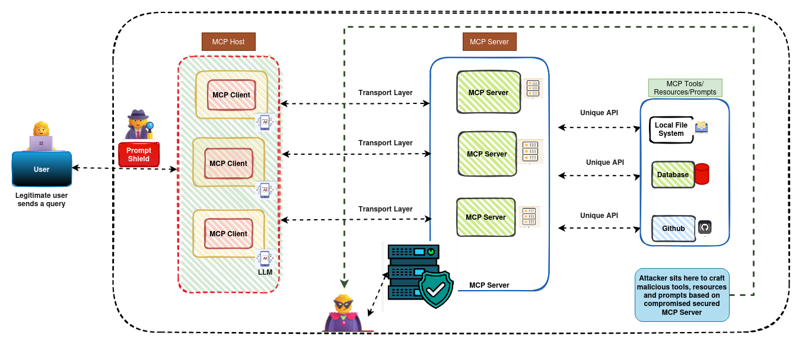

# Context Injection Vulnerabilities and Resource Exploitation Attacks in Model Context Protocol

  - **Corresponding authors:**  [Theophilus Siameh](https://www.linkedin.com/in/theophilus-siameh-793a8626/), [Liu Chun-Hung](https://www.ece.msstate.edu/people/faculty/dr-chun-hung-liu/), [Abigail Akosua Addobea](https://www.linkedin.com/in/madam-akosua-addobea08/)

[](https://opensource.org/licenses/MIT) [](https://github.com/zzli2022/System2-Reasoning-LLM)[]()
<!-- 
[](https://arxiv.org/pdf/2502.21321) -->

<!-- <p align="center">
<a href="https://arxiv.org/abs/2503.22342"> </a> 
</p> -->


<p align="center">
    
</p>

## Abstract

The Model Context Protocol (MCP) introduces a new level of functionality for Large Language Models (LLMs) by enabling direct interaction with external tools and services. Despite its potential to expand the usefulness of AI assistants, this approach also opens up unfamiliar security risks that remain largely unexplored in current research. We present MCP implementations' first comprehensive security analysis, identifying critical vulnerabilities across filesystem, database, and API integration servers. Through systematic penetration testing of $15$ MCP server implementations, we demonstrate successful exploitation of directory traversal, SQL injection, credential extraction, and resource exhaustion attacks. Our analysis reveals that $87\%$  of tested MCP servers contain at least one critical vulnerability, with $34\%$  allowing complete system compromise. We propose a comprehensive taxonomy of MCP security threats and present practical defense mechanisms that reduce attack success rates by up to $94\%$. This work establishes the foundation for secure MCP deployment and highlights the critical need for security-first design in LLM integration protocols.

## MCP Architecture

The diagram illustrates the MCP-enabled client-server architecture, highlighting the modular integration of tools, context providers, and model interfaces.
<p align="center">
  
</p>

---


The diagram shows a traditional architecture lacking MCP, where models interact with tools in an ad hoc or tightly coupled manner, limiting scalability and interoperability.
<p align="center">
  
</p>

---

## MCP Attack Pipelines

The diagram shows an unsecured configuration where the absence of safeguards enables prompt injection, tool misuse, and data exfiltration.
<p align="center">
  
</p>

---

The diagram illustrates a secured pipeline with protections such as prompt shielding, validated tool access, but a compromised secured MCP server.
<p align="center">
  
</p>

---

## MCP Servers
Illustration of Secure and Insecure MCP Server Configurations Targeted by Credential-Based Attacks.
<p align="center">
  
</p>

---

## MCP Tool Poisoning Attack
Example of a malicious MCP silent Tool Hijacking via Prompt Injection and Metadata Exploitation
<p align="center">
  
</p>

---

<br/>

# Project Structure
```bash
mcp-attacks/
│
├── experiments/server.py # MCP server implementation
├── experiments/client.py # Client to simulate attacks
├── requirements.txt      # Dependency list
├── README.md             # Project instructions

```

# Install UV
```bash
# MacOS/Linux
curl -LsSf https://astral.sh/uv/install.sh | sh
# windows
powershell -c "irm https://astral.sh/uv/install.ps1 | more"

# or
brew install uv
# or
pipx install uv
# or
cargo install uv

# Test
uv --version
```

# Set Environment Variables
```bash
cp .env.example .env

# OpenAI API Key
OPENAI_API_KEY= ...
# Anthropic API Key
ANTHROPIC_API_KEY= ...
# Google API Key
GOOGLE_API_KEY= ...
# Model
MODEL_NAME=claude-sonnet-4-20250514 | gpt-4o-mini
```

# 🚀 Installation
To install the **MCP-Attack** project, follow these steps:

1. Clone the repository:
    ```bash
    git clone https://github.com/donwany/mcp-attacks.git
    ```
2. Navigate to the project directory:
    ```bash
    cd mcp-attacks

    # Initialize the uv project
    uv init

    # create virtual environment
    uv venv

    # Activate the environment
    source .venv/bin/activate
    ```
3. Install the required dependencies:
    ```bash
    uv pip install -r pyproject.toml
    # or
    uv pip install -r requirements.txt
    ```
## Open two terminal windows or tabs:
4. Terminal 1: Run the MCP Server
    ```bash
    uv run experiments/server.py
    ```
5. Terminal 2: Run the MCP Client
    ```bash
    uv run experiments/client.py
    ```

## 📌 Contributing 

<br/>
Feel free to ⭐ star and fork this repository to keep up with the latest advancements and contribute to the community.

## 📖 Citation
```bibtex
@article{siameh2025mcp-attack,
  title={Context Injection Vulnerabilities and Resource Exploitation Attacks in Model Context Protocol},
  author={Siameh, Theophilus and Liu, Chun-Hung and Addobea, Akosua Abigail},
  journal={},
  year={2025}
}
```
